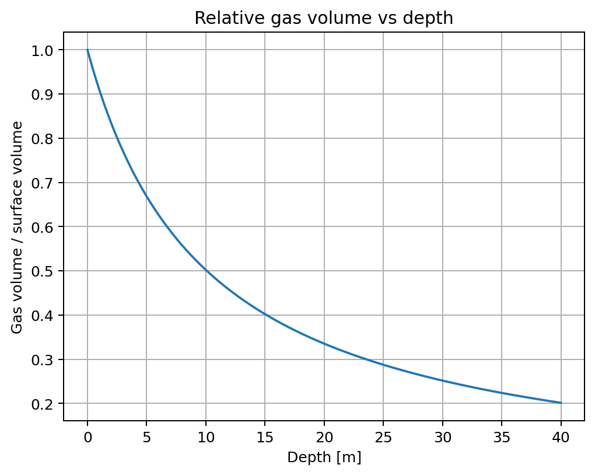
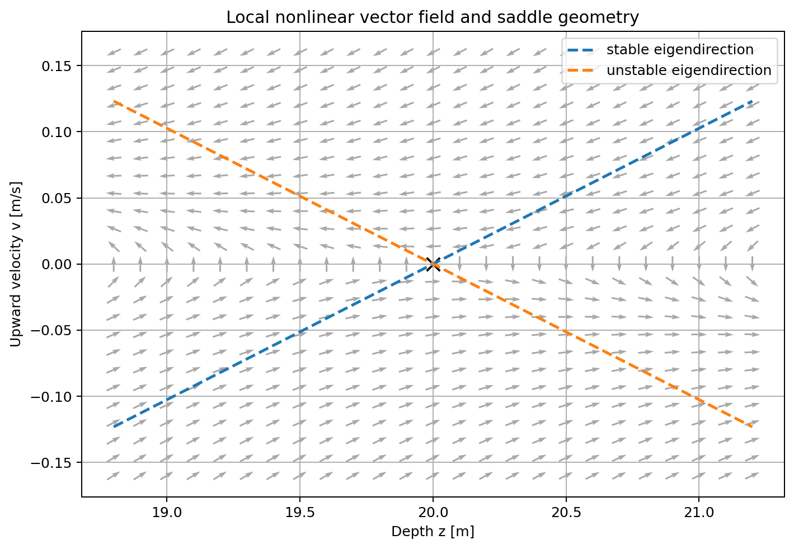
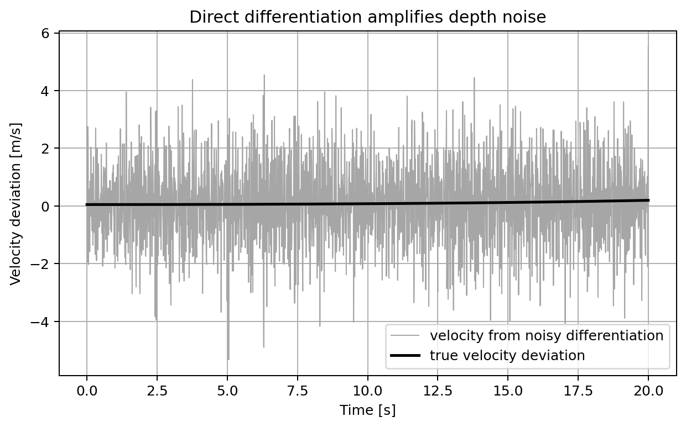
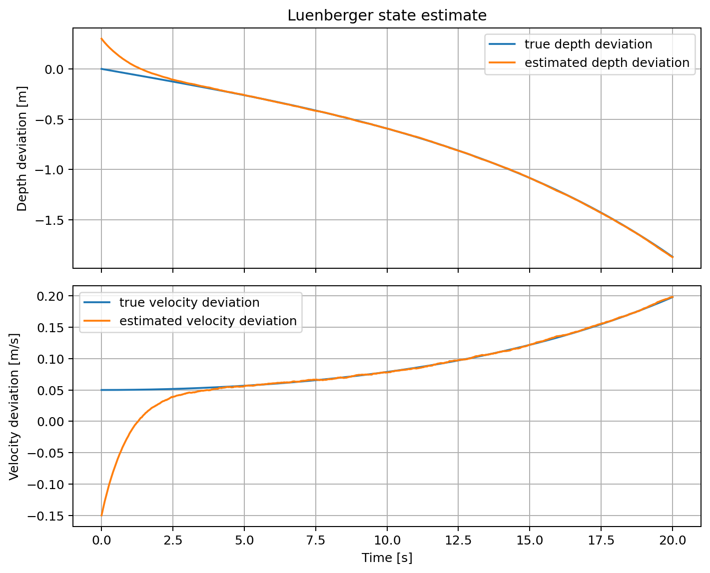
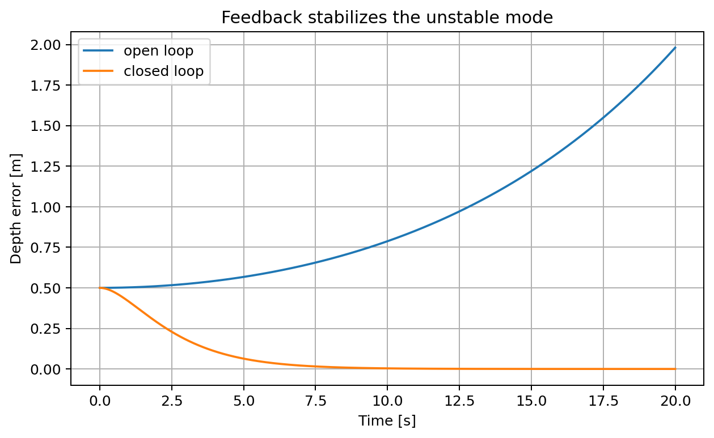
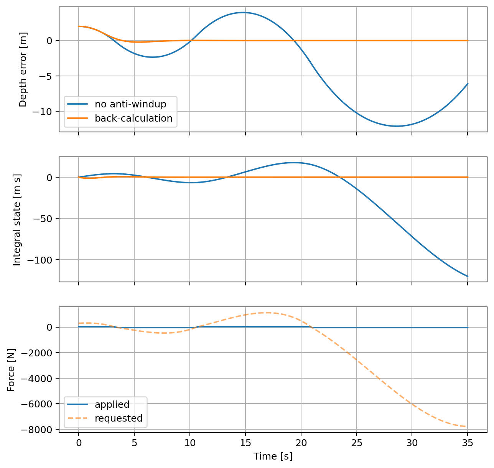
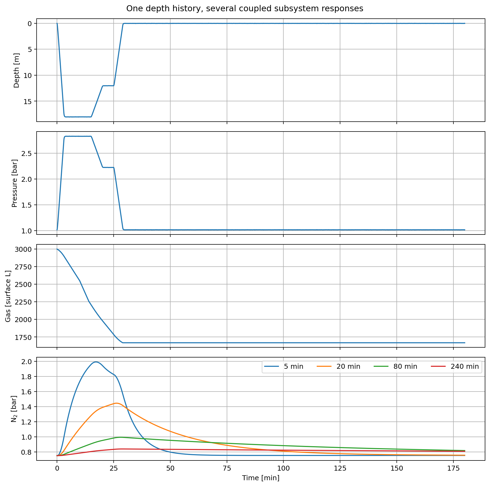

# Introduction

Engineering students commonly encounter hydrostatics, nonlinear dynamics,
linearization, estimation, and feedback as separate topics. The mathematical
links are apparent to an experienced engineer but can remain hidden to a learner
when the physical system changes in every chapter. DiveLab explores a different
curriculum design: retain one physical narrative and progressively increase the
fidelity and analytical viewpoint of its model. Its technical sequence draws on
standard control-system concepts [@ogata2010; @astrom2008], while its executable
form follows the literate, reproducible-workflow role of Jupyter notebooks
[@kluyver2016; @granger2021].

Scuba-diving dynamics provide a compact organizing example. Ambient pressure
changes with depth; flexible gas volumes change with pressure; those volume
changes modify buoyancy; buoyancy modifies vertical motion; and motion feeds the
pressure change back into the loop. Sensing, estimation, actuation, human
decisions, breathing, gas resources, and inert-gas states extend this causal
chain. The result is a system model that grows with the curriculum rather than a
collection of unrelated demonstrations.

The paper makes three contributions:

1. a pedagogical formulation of a standard vertical plant exposing the
   positive-feedback mechanism near neutral buoyancy;
2. an executable architecture in which 18 chapters and notebooks share notation,
   parameters, and causal continuity; and
3. a reproducible, repository-level validation of the full notebook sequence,
   including numerical anchors and explicit evidence and safety boundaries.

This is a framework and artifact paper. It asks whether a physically coherent
example can be represented consistently across a control-engineering sequence
and whether the resulting computational artifact executes reproducibly. It does
not ask whether DiveLab improves student learning; that question requires a
separate empirical study.

# Related work and design gap

Notebook-centered teaching has been used to combine exposition, code, and
results in engineering curricula. Engineers Code organized reusable open
learning modules as Jupyter lessons [@barba2020], and chemical-engineering work
has used notebooks for problem generation and classroom exposition
[@dominguez2021]. More generally, computational notebooks support narratives in
which equations, code, data, and figures remain adjacent [@granger2021]. Their
reproducibility is not automatic, however: execution order, hidden state,
dependency drift, and incomplete environments can undermine an apparently
self-contained artifact [@samuel2024]. DiveLab therefore treats whole-curriculum
execution as a tested property rather than an assumed benefit of the file format.

Scuba buoyancy has also been modeled for engineering purposes. Valenko et al.
developed and experimentally compared a detailed nonlinear diver, buoyancy-
compensator, and pneumatic-valve model [@valenko2016]. Subsequent work has used
such dynamics in automatic buoyancy controllers, including fuzzy-control designs
[@muskinja2023]. DiveLab has a different purpose and deliberately lower model
fidelity: it uses the minimum model needed to reveal a causal feedback loop and
then revisits that same plant through successive control concepts. The detailed
physical literature establishes that buoyancy control is a legitimate dynamic-
systems problem; DiveLab contributes the vertically integrated, executable
curriculum around it.

A recent preprint explicitly analyzes a diver as a delayed PD regulator of a
compressible-buoyancy saddle and studies delay-induced oscillation and saturation
[@herho2026]. That work reinforces the distinction between DiveLab's curriculum
contribution and dynamical analysis of diver control. DiveLab does not claim
priority for the physical instability mechanism or for delayed diver feedback.

The design gap is thus not the absence of notebook-based instruction or diver
models separately. It is the absence, to our knowledge, of an openly executable
control curriculum that follows this particular human-in-the-loop plant from
first principles to a capstone while preserving a traceable set of
assumptions and numerical regression anchors.

# Mathematical framework

## Coordinates, pressure, and gas compression

Let depth $z$ be positive downward and vertical velocity $v$ be positive upward,
so $\dot z=-v$. This mixed convention is intentional: depth matches diving
practice, while positive force and velocity remain upward. With water density
$\rho$, gravitational acceleration $g$, and surface absolute pressure $P_0$,

$$
P(z)=P_0+\rho g z.
$$

Assuming isothermal ideal-gas compression for a flexible volume $V_g$, with
surface-equivalent volume $V_{g0}$,

$$
V_g(z)=V_{g0}\frac{P_0}{P(z)}.
$$

The nonlinearity is strongest near the surface: equal depth changes do not cause
equal fractional volume changes. Figure 1 is generated by Notebook 02
from the same pressure function used downstream.

{#fig-boyle width=75%}

## Forces and nonlinear state model

Let $m$ denote total mass, $V_f$ the approximately fixed displaced volume,
$F_D(v)$ hydrodynamic drag, and $u$ an abstract upward control force. Archimedes'
principle gives

$$
F_B(z)=\rho g\left[V_f+V_g(z)\right].
$$

The vertical dynamics are

$$
\dot z=-v, \qquad
m\dot v=F_B(z)-mg+F_D(v)+u.
$$

The notebooks use the sign-opposing quadratic drag law

$$
F_D(v)=-c_D v|v|,
$$

which is continuous but has zero derivative at $v=0$. The input $u$ is an
educational abstraction. A real buoyancy compensator changes gas volume through
valve dynamics rather than applying force instantaneously; omitting those
dynamics keeps the early control examples interpretable and is revisited as a
limitation.

## Equilibrium and local instability

At a neutral equilibrium $(z_e,0)$ with $u=0$,
$F_B(z_e)=mg$. Define

$$
k_B=\left.\frac{dF_B}{dz}\right|_{z_e}
=-\rho^2g^2V_{g0}\frac{P_0}{(P_0+\rho g z_e)^2}<0.
$$

With perturbation state $x=[\delta z,\delta v]^T$, and ignoring the quadratic
drag term in the infinitesimal linearization,

$$
\dot x=Ax+B\delta u,\qquad
A=\begin{bmatrix}0&-1\\k_B/m&0\end{bmatrix},\quad
B=\begin{bmatrix}0\\1/m\end{bmatrix}.
$$

The characteristic equation is

$$
\lambda^2+\frac{k_B}{m}=0,
$$

so $k_B/m<0$ gives two real poles with opposite signs. This is a saddle, not an
oscillatory neutral mode. In physical terms, a small downward displacement
compresses flexible gas, reduces buoyancy, and promotes further descent; an
upward displacement expands it and promotes further ascent. The feedback is
positive around the chosen equilibrium.

For the reference values $m=85$ kg, $\rho=1025\ \mathrm{kg\,m^{-3}}$,
$z_e=20$ m, $g=9.80665\ \mathrm{m\,s^{-2}}$, $P_0=101325$ Pa, and
$V_{g0}=0.008\ \mathrm{m^3}$ (8 L surface-equivalent gas), the neutral
fixed volume is $V_f=m/\rho-V_g(z_e)=0.080246\ \mathrm{m^3}$. Numerical and analytic
derivatives agree at $k_B=-0.895866\ \mathrm{N\,m^{-1}}$. The poles are
$\lambda=\pm0.102663\ \mathrm{s^{-1}}$, giving an unstable-mode e-folding time
of 9.741 s. Figure 2 displays the local nonlinear vector field and the
linear eigendirections.

{#fig-saddle width=85%}

# Executable curriculum architecture

## Progression and traceability

The curriculum follows four stages (Table 1). Each canonical
chapter has a same-numbered notebook. Every notebook can run independently in
Google Colab, while later notebooks reuse the earlier coordinate convention,
pressure law, plant structure, and reference parameters.

```{=latex}
\begin{table}[htbp]
\centering
\caption{Curriculum progression and its causal hand-offs.}
\small
\begin{tabular}{p{0.14\linewidth}p{0.10\linewidth}p{0.35\linewidth}p{0.25\linewidth}}
\toprule
Stage & Notebooks & Primary ideas & Output carried forward \\
\midrule
Physical laws & 01--04 & Pressure, Boyle's law, Archimedes, vertical forces & Nonlinear buoyancy and force model \\
Dynamical systems & 05--09 & State space, equilibrium, linearization, observability, Kalman filtering, transfer functions & Local plant and estimators \\
Feedback & 10--14 & PD/PID, saturation, frequency response, human decisions, breathing disturbance & Controlled vertical response \\
Integrated systems & 15--18 & Gas consumption, dive-computer estimation, inert-gas states, capstone & Resource histories; separate local feedback \\
\bottomrule
\end{tabular}
\end{table}
```

The architecture separates explanation from experiment. Chapters derive
assumptions, equations, examples, and limitations. Notebooks expose parameters,
simulate alternatives, and produce numerical results. This gives two linked
views of the same material: a readable derivation and an executable experiment.

## Intended learning workflow

Each module follows a recurring sequence:

1. **Understand:** identify variables, signs, units, and causal direction.
2. **Model:** state assumptions and derive the governing relation.
3. **Simulate:** vary parameters and compare nonlinear and local models.
4. **Control or estimate:** introduce feedback, sensing, constraints, or state
   reconstruction only after the open-loop behavior is visible.
5. **Interpret:** distinguish mathematical results from operational diving
   conclusions.

The repetition is deliberate. Learners encounter new control tools without
paying the cognitive cost of learning a new physical plant each time. Conversely,
the repeated plant exposes how a modeling decision made early---such as treating
actuation as force---propagates into later conclusions.

# Representative computational experiments

## Measurement, differentiation, and state estimation

For a depth-only measurement $y=Cx$ with $C=[1\;0]$, the observability matrix is

$$
\mathcal O=\begin{bmatrix}C\\CA\end{bmatrix}
=\begin{bmatrix}1&0\\0&-1\end{bmatrix},
$$

and therefore has rank two. Velocity can be reconstructed from the model and a
depth history. The notebook contrasts this with direct finite differencing,
which amplifies sample noise (Figure 3). Under the specified synthetic
noise and initial-error scenario, sampled at 0.01 s with depth-noise standard
deviation 0.02 m and random seed 42, differentiation produces a velocity RMSE of
1.4356 m/s; a Luenberger observer with requested poles at $-0.7$ and $-1.0$
$\mathrm{s^{-1}}$ produces 0.00078 m/s (Figure 4). Both errors are evaluated
over 5--20 s, excluding the initial transient. The true initial state is
$[0,0.05]^T$ and the observer starts at $[0.30,-0.15]^T$, with depth in
metres and velocity in metres per second.

{#fig-diff width=78%}

{#fig-observer width=82%}

The magnitude of this difference must not be generalized to hardware. It depends
on a correct model, noise assumptions, initialization, and sample rate. The
experiment's instructional purpose is to make the trade-off between a noisy
algebraic operation and model-based dynamic inference concrete. Notebook 08 then
recasts estimation probabilistically with a discrete Kalman filter, obtaining a
velocity RMSE of 0.01593 m/s in its separate stochastic scenario and exposing
sensitivity to $Q$ and $R$.

## State feedback and integral action

For full-state feedback $\delta u=-Kx$, the notebook selects gains that place
the closed-loop poles at $-0.6$ and $-0.9\ \mathrm{s^{-1}}$. Figure 5 compares
the unstable open-loop response with the regulated local
model. The example demonstrates pole placement, but its force command is not a
claim about a realizable buoyancy-compensator actuator.

{#fig-feedback width=75%}

A constant disturbance produces the expected nonzero steady offset under PD
control: the analytical prediction and numerical result are both $-0.1089$ m in
the stated test. Integral action removes this modeled offset. It also creates a
constraint problem when the actuator saturates. In the deliberately severe
Notebook 11 case, the gains are $K_p=150$ N/m, $K_d=180$ N s/m, and
$K_i=60$ N/(m s). The initial depth error is 2 m, the force limit is
$\pm35$ N, the disturbance is zero, and the horizon is 35 s. The
back-calculation coefficient is 0.02 m/N in
$\dot\eta=\delta z+K_{aw}(u-u_{raw})$. Integral absolute error is 177.47 m s without protection and
5.17 m s with back-calculation anti-windup. Figure 6 shows the internal
integrator and requested force diverging when saturation is ignored.

{#fig-windup width=85%}

## Frequency-domain and human-in-the-loop views

The local closed-loop model has natural frequency 0.735 rad/s, damping ratio
1.021, and an approximate $-3$ dB bandwidth of 0.465 rad/s. The frequency-
response notebook uses those quantities to connect pole placement to disturbance
attenuation. Notebook 13 then replaces continuous ideal feedback with sampled,
delayed, quantized decisions. Its particular "predictive" heuristic performs
worse than the reactive baseline (0.303 m versus 0.229 m RMS depth error), an
important negative result: adding anticipation is not intrinsically beneficial
when its model, timing, or gain is poor.

Breathing is introduced as a periodic buoyancy disturbance rather than noise to
be discarded. A 0.5 L volume change corresponds to approximately 5.03 N in the
reference seawater model. This allows the same plant to link frequency response,
disturbance rejection, and a physiological action without claiming a complete
respiratory model.

## Integrated capstone

The final notebook contains two complementary experiments. In the first, a
prescribed depth history drives ambient-pressure calculation, synthetic
measurement, gas-use integration, and simplified parallel inert-gas compartments with nominal
half-times of 5, 20, 80, and 240 minutes. Figure 7 presents the coupled outputs
on a common time base. The second is a separate local feedback experiment
around 18 m, with poles at $-0.35$ and $-0.55\ \mathrm{s^{-1}}$ and a
$\pm12$ N force limit. Its controlled depth is not fed back into the resource
or compartment histories shown in Figure 7. The capstone's main contribution
is architectural: quantities can be labeled as prescribed,
measured, derived, estimated, predicted, or controlled within one state history.

{#fig-capstone width=95%}

The final depth error in the separate local experiment is $-0.306$ m, following
a 5 N constant upward disturbance introduced at 12 s. It agrees with the PD
steady-state offset $-5/[85(0.35)(0.55)]$ m; the controller has no integral
action. It is not a tracking error for the prescribed piecewise dive profile.
The resource histories and local control experiment are complementary
teaching examples rather than a fully coupled dive simulation. Likewise,
the compartment trajectories demonstrate exponential memory; they do not
produce decompression ceilings or schedules.

# Reproducibility and validation

## Artifact structure

The repository contains 18 chapter sources and 18 canonical notebooks. Notebook
imports are limited to NumPy, SciPy, and Matplotlib. The release validator starts
a fresh Jupyter kernel for each notebook using `nbclient`, executes the original
code cells in document order, and captures Matplotlib figures after each cell.
It uses the non-interactive Agg backend so figure counting and export are
explicit; it is a kernel execution test, not a browser or Google Colab UI test.
An appended audit cell checks numerical anchors with explicit absolute
tolerances and zero relative tolerance. The validator requires exactly 18
notebooks, 64 figures, and all selected manuscript figures to be present.
The tested Python 3.12 dependency environment is recorded in
`paper/requirements-lock.txt`; the GitHub Actions workflow repeats the kernel
validation and compiles the standalone LaTeX source on pushes and pull requests.

## Validation result and anchors

On Python 3.12 with NumPy 2.3.5, SciPy 1.17.0, and Matplotlib 3.10.8, all 18
notebooks completed with zero Python exceptions and produced 64 figures. Table 2
records representative anchors selected across the sequence.

| Experiment | Recomputed result |
|---|---:|
| Hydrostatic pressure gradient | 10051.82 Pa/m |
| Buoyancy derivative at 20 m | -0.895866 N/m |
| Open-loop poles | $\pm0.102663\ \mathrm{s^{-1}}$ |
| Unstable e-folding time | 9.741 s |
| Observer velocity RMSE | 0.00078 m/s |
| Finite-difference velocity RMSE | 1.4356 m/s |
| Kalman-filter velocity RMSE | 0.01593 m/s |
| Designed closed-loop poles | -0.6, -0.9 $\mathrm{s^{-1}}$ |
| Windup / anti-windup IAE | $177.47 / 5.17\ \mathrm{m\cdot s}$ |

: Representative numerical regression anchors.

These are deterministic or seeded computational checks, not measurements of
divers. The automated checks use absolute tolerances ranging from $10^{-10}$
for local closed-loop poles to $10^{-4}$ m s for the windup integral; rounded
reported values are checked to their stated precision. These tolerances detect
regressions in the specified numerical experiments, not physical model error.
The LaTeX source package compiles independently of Quarto-generated paths.

# Evidence, safety, and ethical boundaries

DiveLab currently supports claims about internal model consistency, executable
coverage, and curriculum architecture. It does not support a claim that the
approach improves learning outcomes because no learners have yet been studied.
A future evaluation should predefine the participant population, prerequisites,
learning objectives, pre/post instruments, comparison condition, attrition
handling, and statistical analysis before data collection.

The models are educational. They do not generate operational decompression
limits, gas reserves, ascent schedules, medical assessments, equipment
certification, or permission to dive. Real diving requires recognized training,
appropriate supervision, suitable equipment, medical assessment when indicated,
and adherence to established procedures. The computational use of a human diver
as the plant must not be interpreted as support for experimental automatic
buoyancy actuation on people.

# Limitations and future work

The capstone does not yet feed controlled motion into the full resource and
compartment history. The vertical model suppresses added hydrodynamic mass,
changing body geometry, equipment-specific gas
migration, actuator and valve dynamics, uncertain drag, currents, trim, sensor
faults, and individual physiology. Quadratic drag has zero local derivative at
the equilibrium, so damping visible in finite excursions is absent from the
infinitesimal linear plant. The control input is force-like rather than a valve
command. These choices aid instruction but limit physical fidelity.

The physical and pedagogical validation remains incomplete. Successful execution does not prove
that every equation is physically accurate, that every parameter is realistic,
or that each pedagogical transition is effective. Independent model review,
uncertainty analysis and classroom evaluation are distinct future tasks.
The release checks establish computational consistency, not external validity.

The next technical version will therefore: (i) extend the dimensional and
regression checks; (ii) introduce a valve/volume actuator model alongside the
abstract force input; (iii) propagate parameter uncertainty through stability
and control results; (iv) document notebook accessibility and instructor use;
and (v) preregister a small classroom feasibility study before making educational
effectiveness claims.

# Conclusion

DiveLab shows how one physically coherent example can connect basic physics to
state-space modeling, estimation, and feedback without discarding the learner's
accumulated model at each topic boundary. Its central local result---a saddle
equilibrium produced by pressure-dependent flexible-gas buoyancy---provides a
causal thread from hydrostatics to closed-loop regulation. All 18 notebooks
execute under the reported environment, their figures are generated from code,
and representative outputs are recorded as regression anchors. The framework is
now a concrete artifact for technical peer review and a basis for a separate,
future empirical evaluation of its educational value.

# Data and code availability {.unnumbered}

The manuscript, chapter sources, canonical notebooks, validation script, and
figure-generation workflow are maintained at
<https://github.com/fcivardi/divelab>. The paper is developed on branch `paper/arxiv-draft`; the validation record
identifies the exact notebook source revision and the machine-readable anchors.
The submission source archive includes the manuscript and its seven figures.

# Acknowledgements {.unnumbered}

The author used OpenAI's ChatGPT as a writing and software-development assistant
for code inspection, computational validation, editorial restructuring, and
language revision. The author remains responsible for the models, claims,
citations, and final manuscript.

# References {.unnumbered}

::: {#refs}
:::

Book companion website for Åström and Murray (2008): <https://fbsbook.org/>.
